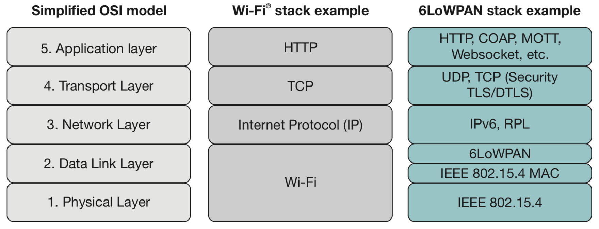
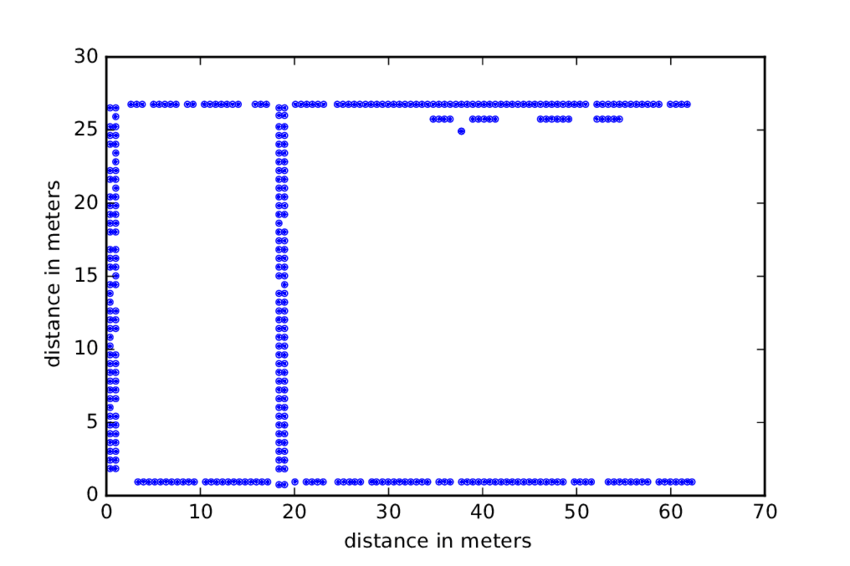
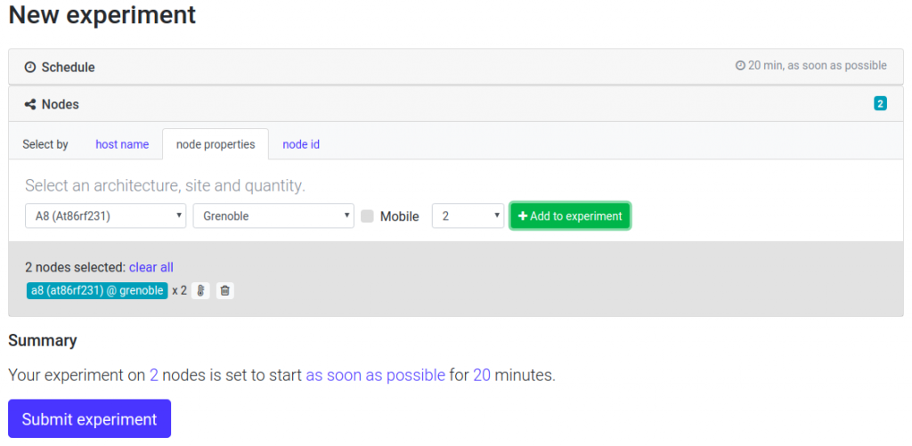
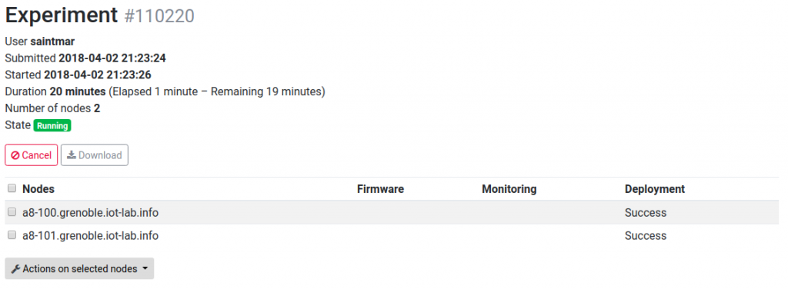

# Data Driven Intrusion Detection


## Table of Contents
1. [IPv6LoWPAN, COAP protocol and RPL](#ipv6lowpan-coap-protocol-and-rpl)
2. [Black Hole attack](#black-hole-attack)
3. [The Experiment](#the-experiment)

## IPv6LoWPAN, COAP protocol and RPL
As the name suggest, **IPv6LowPAN** (*IPv6* over *Lo*w-Power *W*ireless *P*ersonal *A*rea *N*etwork) is a networking technology or adaptation layer that allows IPv6 packets to be carried efficiently within small link layer frames defined by IEEE 802.15.4. The following image shows an example of IPv6LoWPAN network that is connected to the IPv6 network using an edge router. 


The router performs three actions: 
1. the data exchange between IPv6LowPAN devices and the internet;
2. local data exchange between devices inside the IPv6LowPAN;
3. the generation and maintainance of the radio subnet.

Usually IPv6LowPAN networks operate on the edge acting as stub nets, i.e. data going into the network is destined for one of the devices of the IPv6LowPAN net. There are two kind of devices inside a typical IPv6LowPAN network: routers and hosts. Routers route data destined to another nodes in the network and hosts are the end devices.



The image above shows the IPv6LoWPAN stack. As you can see, 6LoWPAN provides an adaptation layer between link and network layers to enable transmission of IPv6 datagrams over IEEE 802.15.4 radio links. We should focus our attention on two important components: the application layer and the network layer.

The application layer is responsible for data formatting and makes sure that data is transported in application-optimal schemes. A broadly used application layer on the internet is HTTP running over TCP, but HTTP has a large overhead, thus it is not optimal to use in many IPv6LoWPAN applications. However, it can still be very useful for communications between IPv6LoWPAN and the internet. To solve this problem, we use the contrained application protocol (**COAP**), a message protocol running over UDP with a bit-optimized REST mechanism that is very easy to map to HTTP via proxies. The protocol is described in RFC 7252 and defines retransmission, confirmable and non-confirmable messages, support for sleepy devices (typical on IoT netoworks!), block transfers, subscription support and resource discovery. 


We can distinguish two kind of routing: mesh-under and route-over. The first uses the link layer addresses to forward data; while route-over uses the network layer, thus each hop in such networks represents one IP router. The usage of IP routing provides the foundation to larger and more powerful and scalable networks, since every router must implement all features supported by  normal IP router. The most used protocol for route-over IPv6LoWPAN networks is the *R*outing Low-*P*ower and *L*ossy network protocol (**RPL**). This protocol is defined in RFC 6550 and supports two different routing models; storing mode and non storing mode. In the first model, all devices configured as routers maintain a routing table and a neighbor table. The routing table is used to look up routes to devices and the neighbor table is used to keep track of a node's direct neighbor. In non-storing mode the only device with a routing table is the edge router, hence source routing is used, i.e. packet includes the complete route it needs to take to reach the destination. The first mode implies higher requirements on the devices acting as routers, while the second increase the overhead as the number of hops a packet needs to traverse to reach the destination grows up.


## Black Hole attack

Black hole attack is a denial-of-service attack in which a router that is supposed to relay packets instead discards them. This usually occurs from a router becoming compromised from a number of different causes. Black hole is one of the well-known security threats in wireless mobile ad hoc networks. The intruders utilize the loophole to carry out their malicious behaviors because the route discovery process is necessary and inevitable. Usually one malicious node utilizes the routing protocol to claim itself of being the shortest path to the destination node and drops the routing packets but does not forward packets to its neighbors.  

The image below shows an example of a *single black hole attack*. Node 1 stands for the source node and node 4 represents the destination node. Node 3 is a malicious node who replies the RREQ packet sent from source node, and makes a false response that it has the quickest route to the destination node. Node 1 erroneously judges the route discovery process with completion, and starts to send data packets to node 3. The malicious node probably drops or consumes the packets. 


In a bit more complex scenario, a couple of malicious nodes collaborate together in order to beguile the normal into their fabricated routing information, hiding from the existing detection scheme.


## Collecting Data

In order to symulate an intrusion, the first step to perform is collecting data from a network. In this experiment we set up a public IPv6/6LoWPAN network in Grenoble with RIOT OS on 7 A8-M3 nodes on Iot-Lab. If you don't have an account on the Iot-Lab website, please register. The following is the topology of Grenoble.



1. Connect to the site host:
```
my_computer$ ssh <login>@grenoble.iot-lab.info
```
2. Get the code of the 2017.07 release of RIOT from GitHub:
```
<login>@grenoble:~$ mkdir -p ~/riot
<login>@grenoble:~$ cd ~/riot
<login>@grenoble:~/riot$ git clone https://github.com/RIOT-OS/RIOT.git
<login>@grenoble:~/riot$ cd RIOT
<login>@grenoble:~/riot/RIOT$ git checkout 2017.07-branch
```
3. Connect to each of the A8-M3 nodes with the following command:
```
<login>@grenoble:~/riot/RIOT$ cd examples/gnrc_networking
<login>@grenoble:~/riot/RIOT$ make BOARD=iotlab-a8-m3 clean all
<login>@grenoble:~/riot/RIOT$ cp bin/iotlab-a8-m3/gnrc_networking.elf ~/riot
```
4. Retrieve the generated binary firmware file on your computer:
```
my_computer$ scp <login>@grenoble.iot-lab.info:riot/gnrc_networking.elf gnrc_networking.elf
```
5. Launch a new experiment on  IoT-LAB testbed


wait experiment state Running in the Schedule dashboard section


6. Now we connect to the RIOT shell on the A8-M3 nodes using miniterm.py:
```
root@node-a8-<id>:~$ ssh root@node-a8-<id>
root@node-a8-<id>:~$ --echo /dev/ttyA8_M3 500000 | tee output<id>.log
```
7. We start the RPL protocol on the root node:
```
root@node-a8-<id>:~$ rpl init 7
root@node-a8-<id>:~$ ifconfig 7 set power -17
root@node-a8-<id>:~$ ifconfig 7 add 2001:db8::1
root@node-a8-<id>:~$ rpl root 1 2001:db8::1
root@node-a8-<id>:~$ rpl
```
8. For each other A8-M3 node we start rpl
```
root@node-a8-<id>:~$ rpl init 7
root@node-a8-<id>:~$ ifconfig 7 set power -17
root@node-a8-<id>:~$ rpl
```
9. Now you can ping the nodes.
